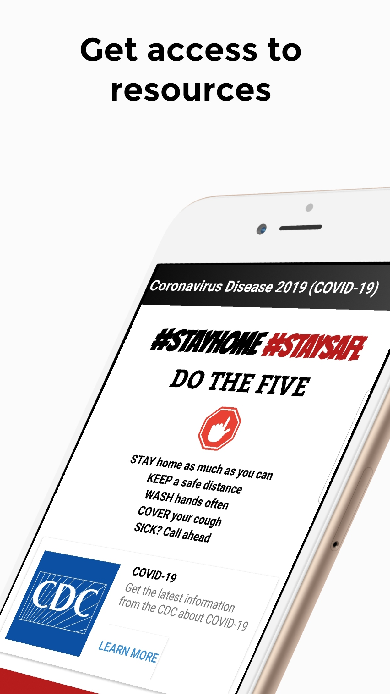

# COVID-19 TRACKER

COVID-19 Tracker allows you to monitor the number of COVID-19 cases around the globe and different countries as the spread of disease is increasing. The sole purpose of this application is to keep you aware of the spread of disease around you and help you share credible and trustworthy information with your friends and family. This is a one-stop application, which means it includes all the things you need to track the corona-virus. This application includes: 

1. Home page: Includes global statistics view so that you can take a quick glance and know the total spread of corona-virus pandemic around the globe. This page also includes a bar-chart for the top 5 countries with information about their confirmed, active, and fatal cases so that you can compare them with each other. 

2. Stats page: This is the page where you will see all the countries that are affected by corona-virus. You can view specific detail like confirmed, active, recovered, fatal, new cases, new deaths, serious critical, total cases per one million population for each country. With the help of search functionality, you can find any country details. You get all this information from a reliable source that gets updated every minute. 

3. News page: This page makes this application a 'one-stop' application. You can read all the corona-virus news from different authentic sources here. You can also select a different country to read their news. This page is supported by 'Google News API' which means that it gets updated frequently and contains news from diverse sources. 

4. Help page: Our Help page allows you to get access to a screening tool developed by Apple, CDC, White House, and FEMA. This page will keep getting updated in the future with useful resources and information on how to protect yourself from corona-virus. 

You will find all of these features under one hood for free. Again, this application is built to help the community to increase their awareness level for the corona-virus. There is a lot of misinformation floating around the society and a COVID-19 Tracker tool will allow you to get trustworthy information from credible sources.

News page is powered by NewsAPI.org

  

    
  

  

    
  

  

    
  

  

    
  

